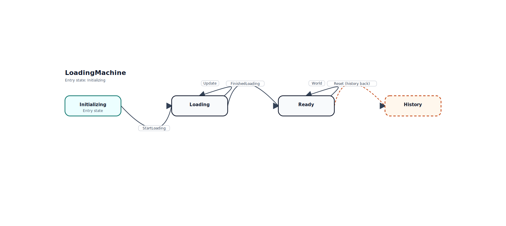

# CLI

Fizz ships a `fizz` command-line interface for repository and machine-level tooling.

## Commands

| Command          | Purpose                                                                             |
| ---------------- | ----------------------------------------------------------------------------------- |
| `fizz machines`  | List discovered Fizz machine roots under the current folder.                        |
| `fizz visualize` | Discover a canonical Fizz machine and write text, SVG, or Mermaid diagrams to disk. |

## `fizz machines`

`fizz machines` prints the machine roots the CLI can discover without prompting.

```bash
npx fizz machines --cwd .
```

Use `--source <path>` to narrow the output to one machine entrypoint.

## `fizz visualize`

`fizz visualize` turns a canonical Fizz machine into checked diagram output you can review in pull requests, publish in docs, or keep beside the machine source.

### Basic usage

Point the command at a machine entrypoint, choose one or more formats, and write the generated files to disk.

```bash
npx fizz visualize \
  --cwd . \
  --source ./src/loadingMachine/index.ts \
  --format text \
  --format svg \
  --format mermaid \
  --output-dir ./src/loadingMachine \
  --no-interactive
```

This is the same shape used in this repository to keep the built-in LoadingMachine artifacts current.

### Flags

- `--machine <name>` selects one discovered machine by name
- `--source <path>` targets a specific machine entrypoint
- `--format <type>` chooses `text`, `svg`, or `mermaid`; repeat it to render multiple formats
- `--output <path>` writes a single rendered format to one explicit file path
- `--output-dir <path>` chooses the directory used for generated files
- `--cwd <path>` changes the search root for discovery
- `--no-interactive` fails instead of prompting when required inputs are missing
- `-h, --help` prints command help

### Interactive mode

When you omit `--machine`, `--source`, or `--format`, the CLI can prompt for the missing values.

```bash
npx fizz visualize
```

The command will scan from the current working directory, list discovered canonical Fizz machines, ask which one to render, then ask whether to generate text, SVG, Mermaid, or a combined output selection.

### Example text output

The current checked text artifact for LoadingMachine is:

```text
Fizz Machine Diagram
Machine: LoadingMachine
Source: src/loadingMachine/index.ts
Entry: Initializing

States
- Initializing
- Loading
- Ready

Details
- Initializing
  transitions:
    - StartLoading -> Loading
  notes:
    - Enter: dispatches StartLoading
- Loading
  transitions:
    - FinishedLoading -> Ready
    - Update -> Loading
- Ready
  transitions:
    - Reset -> History (history back)
    - World -> Ready
  outputs: Hello
  notes:
    - Enter: emits output
    - Reset: uses goBack
- History
  notes:
    - Synthetic node for goBack transitions

Outputs
- Hello

State Graph
[Initializing]
  StartLoading -> [Loading]
[Loading]
  FinishedLoading -> [Ready]
  Update -> [Loading]
[Ready]
  Reset -> [History]
  World -> [Ready]
[History]
```

### Example SVG output

The current checked SVG artifact for LoadingMachine is rendered below.



This example is not a hand-maintained mockup. It comes from the checked artifact generated by `fizz visualize`, which keeps the docs aligned with actual CLI output.

### What `visualize` discovers

Version 1 intentionally targets explicit machine roots created with `createMachine(...)`.

- machine entrypoints export a `createMachine(...)` result
- the `states` property points at the state map for traversal
- state files are still built with `state(...)`
- nested state files are still built with `stateWithNested(...)`

When a parent state owns a nested machine, the text, SVG, and Mermaid renderers show that relationship explicitly: the parent lists its nested entry state, nested child states render inside the parent's nested boundary for diagram outputs, and child transitions are included in the generated graph.

That keeps the generated diagrams deterministic and makes it practical to use the command in automation.

## Related Docs

- [Getting Started](./getting-started.md)
- [Architecture](./architecture.md)
- [Nested State Machines](./nested-state-machines.md)
- [Testing](./testing.md)
- [API](./api.md)
